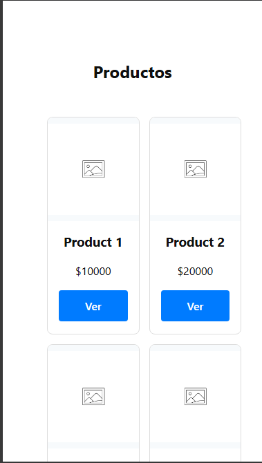
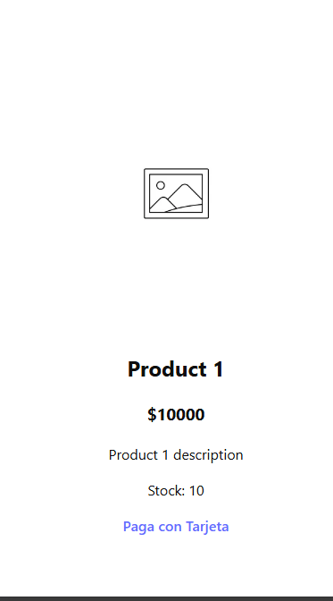
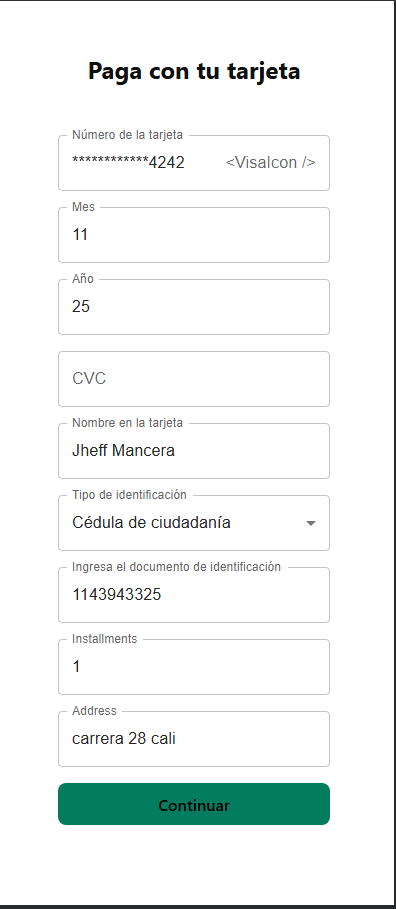
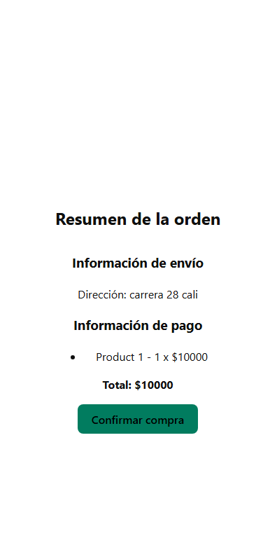
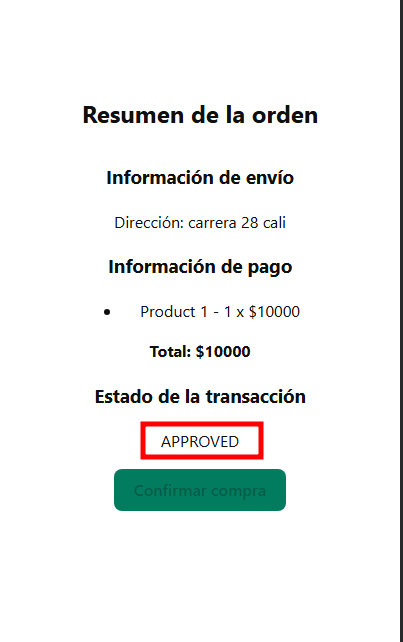

# Retail full stack application

This is a monorepository with a NestJs and ReactJs/Vite project for a retail full stack application.
- Hexagonal architecture
- DDD principles
- Some TDD practices are applied
- Integrated with a payment gateway

# Demo Site
http://dev-retail-app-front.us-east-1.elasticbeanstalk.com/

# Environment Requirements
- NodeJs Version: 22.12.0

# Starting the App
- Clone the repository

## Backend
- `cd server`
- Copy `.env.example` and rename it to `.env`
- Edit the `.env` file according to your keys, ports, and URLs
  - You need to provide a MongoDB URL
- `npm install`
- `npm run start:dev`

### Initialize Mock Data
- Make a `POST` call to the `/products/populate` endpoint of the backend to populate the `products` collection in your MongoDB database

## Frontend
- `cd client`
- Copy `.env.example` and rename it to `.env`
- Edit the `.env` file according to your backend RESTful API settings from the previous section
- `npm install`
- `npm run dev`

# RESTful API Documentation
[Go to the Postman collection here](https://www.postman.com/altimetry-explorer-80161005/workspace/product-payment-api-demo/collection/34406596-340ed140-9924-422e-bd4a-c2c6089974e5?action=share&creator=34406596&active-environment=34406596-cf070561-3f71-4238-b2f5-f5a6ad411d81)

# Data to test credit card

Number: `4242424242424242`

Type: "Visa"

Date: `12/34`

# Mockup

# Screenshots

